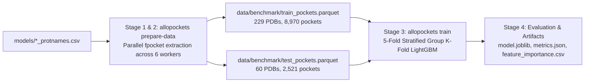

# AlloPockets Benchmark Training & Evaluation Experiment

This document details the full benchmark training and evaluation experiment for allosteric pocket classification in AlloPockets. It provides the exact commands, execution stages, performance metrics, and artifact references needed to understand or reproduce the results.

---

## 1. Automated Execution Script

An automated, self-contained bash script is provided at [`scripts/run_full_training_experiment.sh`](../scripts/run_full_training_experiment.sh). It runs the complete multi-stage pipeline from pocket extraction through cross-validation and test set evaluation:

```bash
./scripts/run_full_training_experiment.sh
```

### Environment & Options
- **Parallel Workers**: Defaults to 6 workers. Can be customized via `WORKERS`:
  ```bash
  WORKERS=8 ./scripts/run_full_training_experiment.sh
  ```
- **Caching**: If parquet datasets already exist in `data/benchmark/`, extraction is skipped automatically. To force full re-extraction:
  ```bash
  FORCE_REEXTRACT=1 ./scripts/run_full_training_experiment.sh
  ```

---

## 2. Pipeline Execution Steps



### Step 1: Benchmark Train Set Featurization
Extract candidate pockets and compute 23 numerical descriptors for all 229 complexes in the training benchmark set (`models/trainset_protnames.csv`):

```bash
python -m allopockets.cli prepare-data \
    --db data/database.db \
    --pdb-file models/trainset_protnames.csv \
    --outdir data/benchmark \
    --filename train_pockets.parquet \
    --workers 6
```

- **Input**: `data/database.db` and `models/trainset_protnames.csv` (229 PDB IDs).
- **Processing**: Multi-threaded extraction with `ThreadPoolExecutor` running `fpocket` and biophysical feature extraction.
- **Output**: [`data/benchmark/train_pockets.parquet`](../data/benchmark/train_pockets.parquet)
  - Total pockets: **8,970**
  - Positive allosteric pockets: **46** (0.5% prevalence, defined by `site_in_pocket >= 0.65`)
  - Negative candidate pockets: **8,924**

### Step 2: Independent Held-Out Test Set Featurization
Extract candidate pockets and compute descriptors for all 60 complexes in the independent test benchmark set (`models/testset_protnames.csv`):

```bash
python -m allopockets.cli prepare-data \
    --db data/database.db \
    --pdb-file models/testset_protnames.csv \
    --outdir data/benchmark \
    --filename test_pockets.parquet \
    --workers 6
```

- **Input**: `data/database.db` and `models/testset_protnames.csv` (60 PDB IDs).
- **Output**: [`data/benchmark/test_pockets.parquet`](../data/benchmark/test_pockets.parquet)
  - Total pockets: **2,521**
  - Positive allosteric pockets: **8** (0.3% prevalence)
  - Negative candidate pockets: **2,513**

### Step 3: Model Training & Evaluation
Train a reproducible LightGBM classifier with 5-fold Stratified Group Cross-Validation on the training set, group-stratified by PDB ID to ensure zero data leakage across folds, and evaluate the final model against the held-out test set:

```bash
python -m allopockets.cli train \
    --data data/benchmark/train_pockets.parquet \
    --test-data data/benchmark/test_pockets.parquet \
    --model lightgbm \
    --outdir models/benchmark_experiment \
    --n-estimators 300 \
    --lr 0.03 \
    --max-depth 6 \
    --splits 5
```

- **Cross-Validation Scheme**: 5-Fold Stratified Group K-Fold (`get_group_splits`).
- **Class Imbalance Handling**: Dynamic `scale_pos_weight = n_neg / n_pos` (approx. 194:1).
- **Output Directory**: [`models/benchmark_experiment/`](../models/benchmark_experiment/)

### Step 4: Artifact Generation & Summary
The pipeline automatically writes serialized model weights, registered feature lists, metrics summaries, and feature importances to `models/benchmark_experiment/`.

---

## 3. Benchmark Results Summary

### Performance Metrics

| Evaluation Stage | Metric | Score | Description |
|---|---|---|---|
| **5-Fold Cross-Validation (OOF)** | **ROC-AUC** | **0.7879** | Area under the Receiver Operating Characteristic curve |
| | **PR-AUC** | **0.0251** | Area under the Precision-Recall curve |
| | **MCC** | **0.0234** | Matthews Correlation Coefficient |
| | **Top-1 Pocket Retrieval** | **16.3%** | Ground-truth allosteric pocket ranked #1 by predicted score |
| | **Top-3 Pocket Retrieval** | **34.9%** | Ground-truth allosteric pocket ranked in top 3 predicted pockets |
| **Independent Held-Out Test Set** | **Test ROC-AUC** | **0.7443** | Generalization ROC-AUC on 60 unseen protein complexes |
| (60 PDBs, 2,521 pockets) | **Test PR-AUC** | **0.0311** | Precision-Recall AUC on unseen test complexes |
| | **Test MCC** | **-0.0022** | Held-out Matthews Correlation Coefficient at standard threshold |
| | **Test Top-1 Retrieval** | **12.5%** | Test complexes with true pocket ranked #1 |
| | **Test Top-3 Retrieval** | **25.0%** | Test complexes with true pocket ranked in top 3 |

### Top Informative Features

Feature importances extracted from the trained LightGBM model ([`models/benchmark_experiment/feature_importance.csv`](../models/benchmark_experiment/feature_importance.csv)):

| Rank | Feature Name | Split Importance | Biophysical Description |
|:---:|---|:---:|---|
| 1 | `FPocket_Drug Score` | 640 | FPocket druggability score based on pocket geometry and hydrophobicity |
| 2 | `FPocket_Pocket Score` | 619 | Overall cavity size and compactness score |
| 3 | `FPocket_Mean alpha-sphere radius` | 557 | Average radius of Voronoi alpha spheres defining cavity boundaries |
| 4 | `FPocket_Mean B-factor of pocket residues` | 512 | Average crystallographic temperature factor (pocket residue flexibility) |
| 5 | `FPocket_Proportion of apolar alpha sphere` | 505 | Ratio of hydrophobic contact spheres to total alpha spheres |
| 6 | `FPocket_Hydrophobicity Score` | 470 | Overall hydrophobic character of cavity lining |
| 7 | `FPocket_Apolar SASA` | 470 | Solvent accessible surface area contributed by apolar atoms |
| 8 | `FPocket_Mean alpha-sphere Solvent Acc.` | 426 | Solvent accessibility of alpha sphere centers |
| 9 | `FPocket_Amino Acid based volume Score` | 415 | Volume estimation derived from constituent amino acid sidechains |
| 10 | `FPocket_Local hydrophobic density Score` | 413 | Spatial clustering of hydrophobic contact points within the pocket |

---

## 4. Generated Artifacts & Directory Layout

```
AlloPockets/
├── scripts/
│   └── run_full_training_experiment.sh    # End-to-end executable benchmark script
├── data/
│   └── benchmark/
│       ├── train_pockets.parquet          # 8,970 featurized pockets (229 train PDBs)
│       └── test_pockets.parquet           # 2,521 featurized pockets (60 test PDBs)
├── models/
│   └── benchmark_experiment/
│       ├── model.joblib                   # Serialized LightGBM trained classifier
│       ├── features.json                  # Ordered list of 23 input features
│       ├── metadata.json                  # Training configuration and hyperparameters
│       ├── metrics.json                   # Complete CV and test evaluation metrics
│       └── feature_importance.csv         # Full 23-feature importance ranking
└── docs/
    └── BENCHMARK_EXPERIMENT.md            # This documentation file
```
